## 一、maven的下载

1.选择官网：[Maven – Welcome to Apache Maven](https://maven.apache.org/)
2.找到download  —— Files —— Binary zip archive （Link）下载

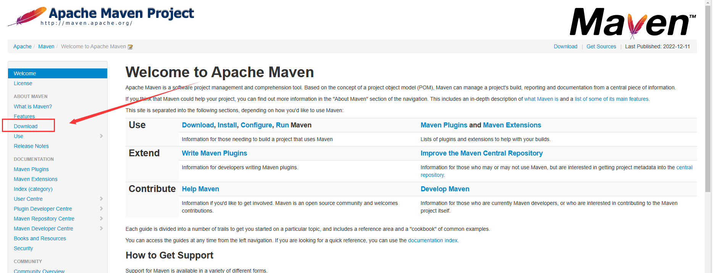

 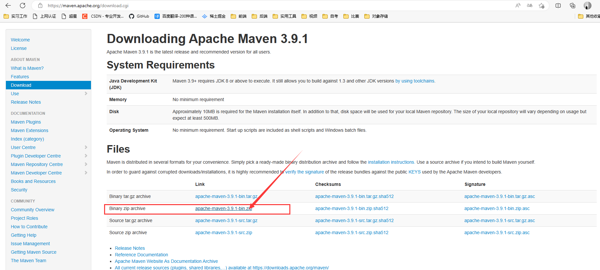

3.下载完成后放到自己的文件目录下进行直接解压，不要放在文件目录下（这是为什么，咱也不知道，参考教程上这么说，咱也这么做）
ps：文件目录自己选择

## 二 、配置环境变量

1.进入高级系统设置

方法1：选择桌面电脑鼠标右击此电脑，点击属性进入系统信息界面

方法2：通过“控制面板”，选择“系统和安全”，再选择“系统”

在系统信息界面左侧点击 高级系统设置

 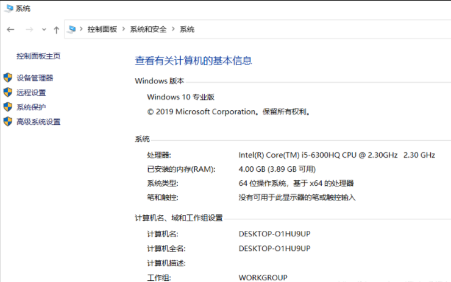


2.在高级系统设置界面，点击 环境变量

 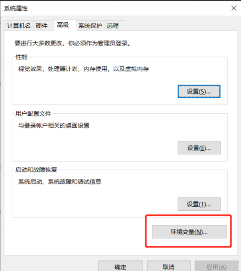

 

 3.在 环境变量 的 系统变量设置2项属性，MAVEN_HOME 和 Path。若存在则在此基础上“编辑”，不存在则“新建”

 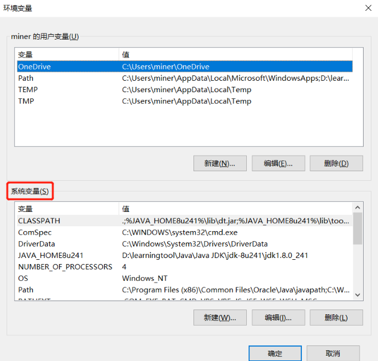


3.1 MAVEN_HOME

 新建 MAVEN_HOME变量，变量值为MAVEN安装目录

 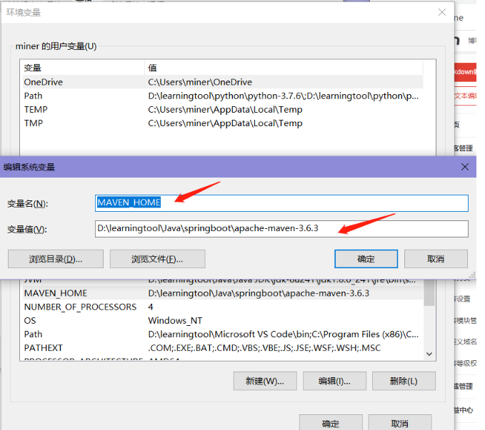


3.2  Path

 编辑 Path 系统变量，新建值 

```
%MAVEN_HOME%\bin
```

## 三、 验证是否成功 

在maven目录下按住shift键点击鼠标右键，选择点击此处打开powershell窗口，输入mvn -v（或 mvn -version），出现如图所示即成功（不成功就看看cmd的目录是否正确，再不成功，咱没遇到也不知道，自求多福？）

 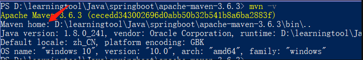


## 四 、配置本地仓库

1.方法1：直接在刚才的cmd命令提示符输入maven help:system或mvn help:system，配置maven本地库（不推荐）

**2.方法2：但我建议你，不要直接使用命令“maven help:system”（推荐）**
如果直接使用，它会把maven的本地库的内容放在本地磁盘的${user.home}/.m2/repository，如果你的本地磁盘足够大，可以忽略。否则修改安装目录

2.1 在刚才的maven的同级目录下新建一个Workspace文件，在该文件目录下新建MavenRepository文件夹，该目录用作maven的本地库
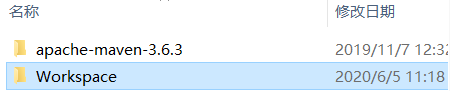

2.2 在maven目录下的conf中找到settings.xml，用记事本打开文件，输入以下代码：

```xml
<!-- 下面是自己设置的本地仓库位置-->
<localRepository>MavenRepository文件位置</localRepository>
```

2.3 在cmd中输入 以下代码

```
maven help:system
或
mvn help:system
```

3.由于外网下载速度慢，要是你的速度快，可以忽略。否则在maven目录下的conf中找到settings.xml，用记事本打开文件，输入以下代码：

```xml
<!-- 设置阿里云镜像-->
<mirror>
        <id>alimaven</id>
        <mirrorOf>central</mirrorOf>
        <name>aliyun maven</name>
        <url>http://maven.aliyun.com/nexus/content/repositories/central/</url>
</mirror>
```

 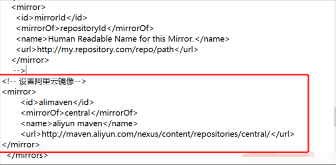

 

4.运行成功后，

cmd中会显示

 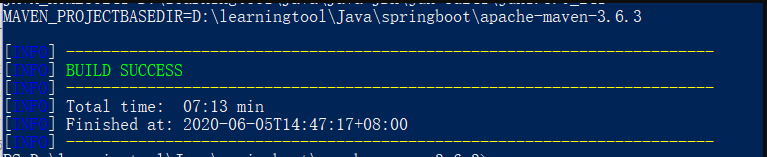

 

在MavenRepository文件夹中会出现下列文件

 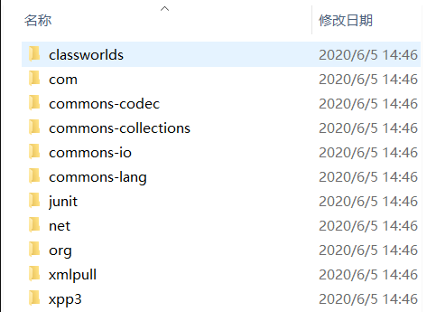

 成功！

 **补充：**

在idea中maven的本地仓库依旧是c:/user/.m2/repository，当你的idea自动帮你下载包的时候，就不会放到你自己设定的位置，所以你需要在idea中进行修改，其他开发工具应该也是一样的。

修改位置：file - setting 中（以及file - other settings -default settings），搜索maven ，对 maven home directory和User settings file进行修改，

Maven Home directory改成你自己的maven程序的目录，这个一定要指定，否则默认使用idea的Maven程序

User settings file 改成你自己maven目录config中的settings.xml

注意：local repository 如果你按照之前的步骤设置了自己的maven本地库，此时就不用修改，否则你还需要手动指定你的Jar包的文件夹目录。

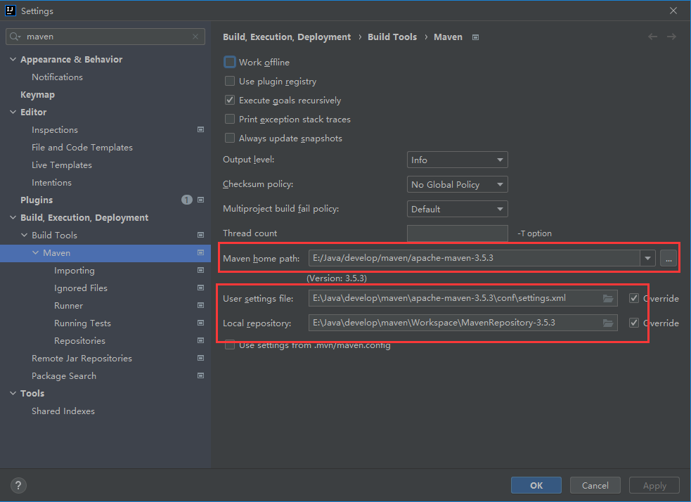